# 🚀 PromptStudio AI - Portal Dokumentasi Utama

Selamat datang di **PromptStudio AI**, platform cerdas yang dirancang untuk mempermudah pembuatan prompa (prompt) profesional menggunakan teknologi AI LLM (Large Language Model) dari Groq Cloud (Llama 3.3 70B & Llama 3.2 11B Vision). Aplikasi ini menyediakan generator prompa terstruktur untuk pembuatan konten edukasi (carousel), iklan affiliate (produk viral), kata mutiara (sinematik/estetik), deskripsi produk digital, hingga pembuatan logo.

Platform ini terdiri dari **Aplikasi Mobile (Flutter)** cross-platform yang responsif dan **Layanan Backend Gateway (Node.js/Express/TypeScript)** yang tangguh dengan sistem rotasi API Key otomatis untuk menjamin keandalan sistem.

---

## 📂 Struktur Dokumentasi (5 Buku Panduan)

Untuk mempermudah pemahaman sistem secara terpisah dan terperinci, dokumentasi ini dibagi menjadi 5 bagian utama yang terhubung secara relatif:

1. 🏠 **[README.md](README.md) (Dokumen Ini)**: Panduan ringkas, galeri demo aplikasi, serta peta arsitektur sistem.
2. 📱 **[FRONTEND_DOCS.md](FRONTEND_DOCS.md)**: Arsitektur aplikasi mobile Flutter, pola manajemen status (*Provider*), local database cache (SQLite/Sqflite), dan detail layar.
3. ⚙️ **[BACKEND_API_DOCS.md](BACKEND_API_DOCS.md)**: Panduan API gateway Node.js & TypeScript, rincian endpoint, dan sistem rotasi otomatis Groq API Key.
4. 🛠️ **[PANDUAN_INSTALASI.md](PANDUAN_INSTALASI.md)**: Langkah-langkah instalasi lingkungan pengembangan local untuk Flutter, Express.js backend, serta inisialisasi basis data MySQL & SQLite.
5. 📖 **[PANDUAN_PENGGUNAAN.md](PANDUAN_PENGGUNAAN.md)**: Petunjuk interaktif cara mengoperasikan aplikasi, membuat prompt kustom, dan menggunakan panel administrator.

---

## 🏗️ Arsitektur Sistem (System Architecture)

Diagram di bawah ini menggambarkan bagaimana komponen aplikasi saling berinteraksi, mulai dari input pengguna di perangkat mobile hingga eksekusi prompt di model AI Groq Cloud:

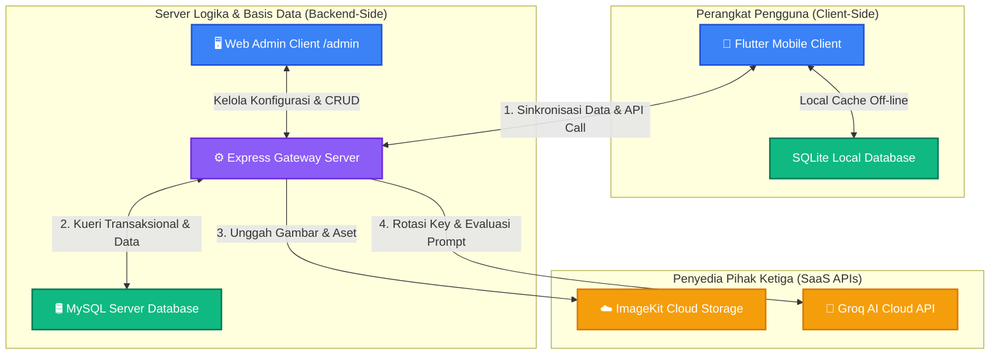

---

## 📸 Peta Galeri Demo Aset (`assets/demo/`)

Berikut adalah galeri tangkapan layar (screenshot) demo antarmuka pengguna yang terdapat pada folder `assets/demo/` dengan resolusi yang sudah dioptimalkan agar tidak terlalu besar di halaman repositori:

### 🖥️ 1. Antarmuka Panel Web Admin & Gateway Server
Tangkapan layar di bawah diambil dari browser saat mengelola sistem melalui Web Admin Panel di port Express Gateway:

* **Dashboard Gateway Landing Page**
  
  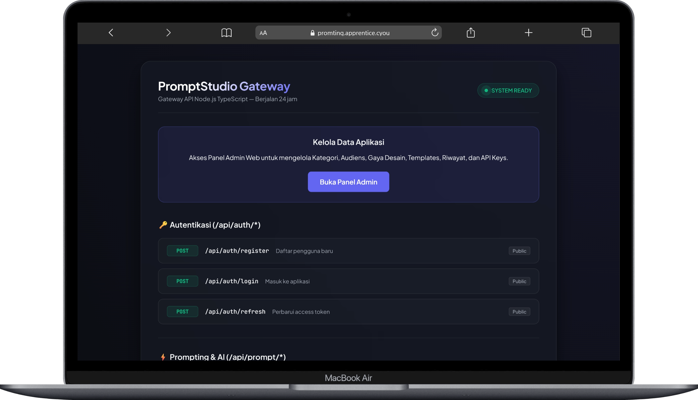
  
  *Deskripsi:* Halaman pendaratan server (`/`) yang menunjukkan status kesehatan sistem ("SYSTEM READY") serta rincian dokumentasi endpoint API interaktif.

* **Web Admin - Gaya & Tema Desain**
  
  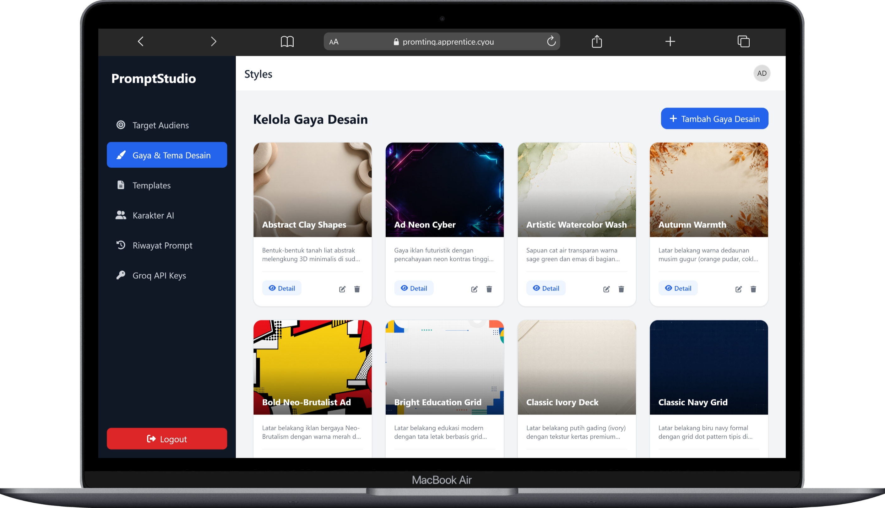
  
  *Deskripsi:* Panel kelola gaya desain visual untuk prompt AI (misal: Minimalist, Cyberpunk, Neo-Brutalist) beserta prompt dasar visual.

* **Web Admin - Target Audiens**
  
  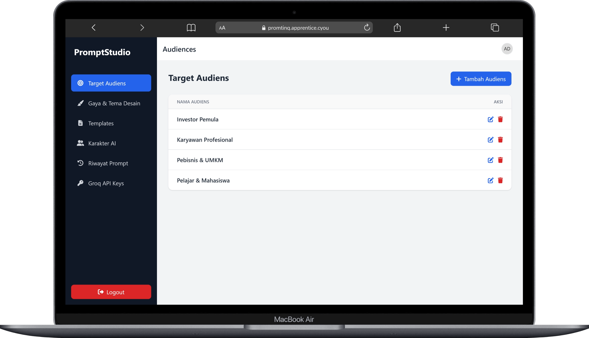
  
  *Deskripsi:* Layar CRUD untuk mengelola kategori audiens target (misal: Karyawan, Pelajar, Investor Pemula) yang akan disuntikkan ke dalam prompt AI.

* **Web Admin - Katalog Templates & Preset**
  
  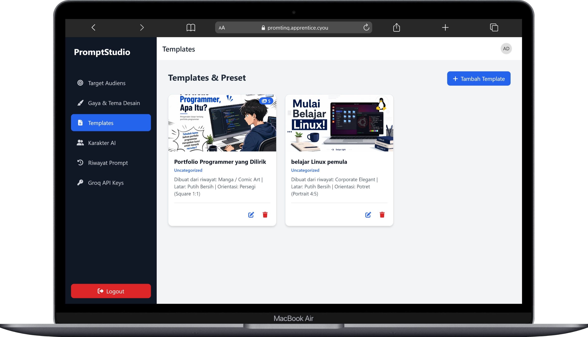
  
  *Deskripsi:* Layar untuk mengatur template dasar slide/carousel interaktif yang dapat dipilih oleh pengguna di aplikasi mobile.

* **Web Admin - Profil Karakter AI**
  
  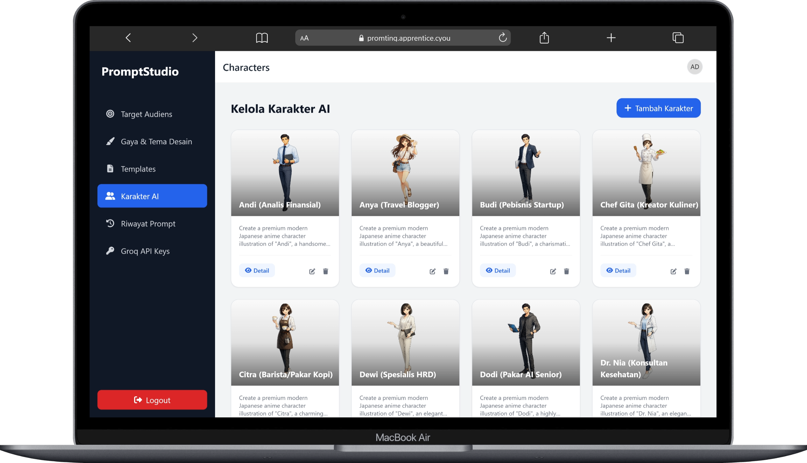
  
  *Deskripsi:* Pengaturan avatar dan prompt kepribadian (personality prompt) karakter AI pendukung seperti Andi (Analis Finansial) atau Anya (Travel Blogger).

* **Web Admin - Riwayat Pembuatan Global**
  
  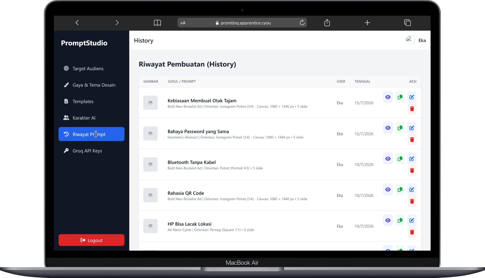
  
  *Deskripsi:* Log pemantauan semua riwayat pembuatan prompt oleh seluruh pengguna, lengkap dengan spesifikasi rasio gambar dan slide.

* **Web Admin - Groq API Keys Health Monitor**
  
  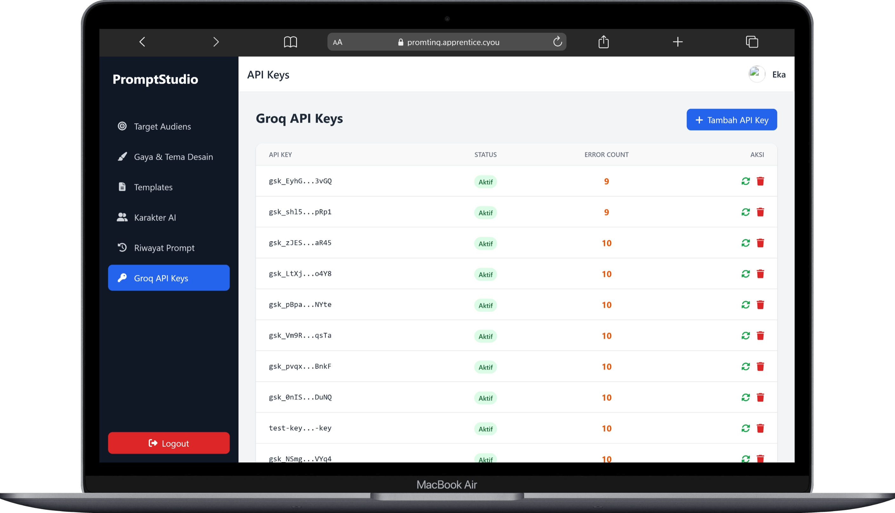
  
  *Deskripsi:* Pemantauan status keaktifan kunci API Groq beserta pencatat jumlah kesalahan (error count) untuk memicu proses rotasi kunci.

---

### 📱 2. Antarmuka Aplikasi Flutter Mobile Client
Kumpulan tangkapan layar di bawah menunjukkan tampilan aplikasi klien seluler Flutter pada perangkat ponsel (dipersempit ke lebar `260px` agar tampak proporsional sebagai perangkat seluler):

* **Layar Selamat Datang / Login**
  
  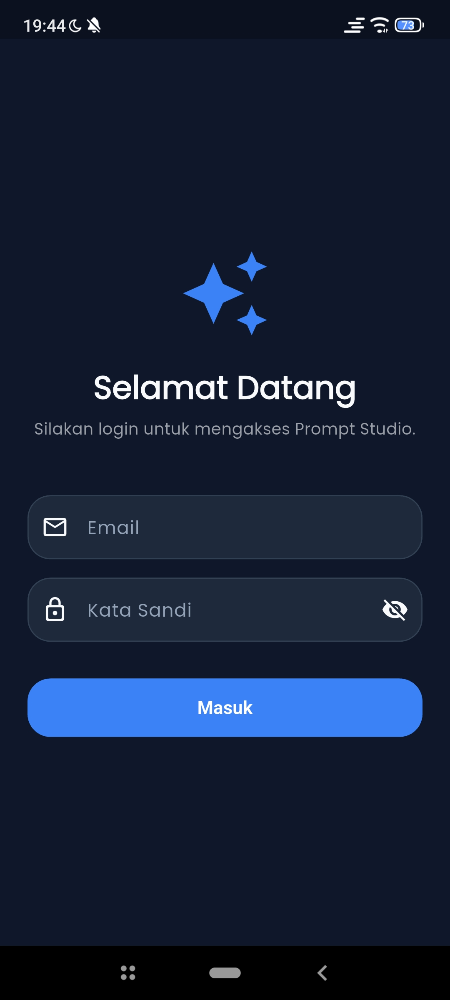
  
  *Deskripsi:* Layar masuk autentikasi pengguna dengan tema gelap premium dan masukan terproteksi kata sandi.

* **Layar Beranda / Dashboard**
  
  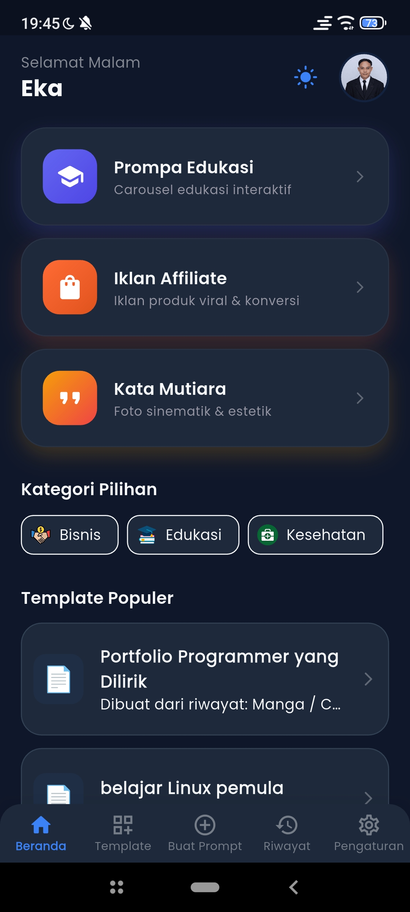
  
  *Deskripsi:* Dasbor utama pengguna yang menampilkan jalan pintas generator, filter kategori pilihan, dan daftar template terpopuler.

* **Layar Generator Prompa Edukasi**
  
  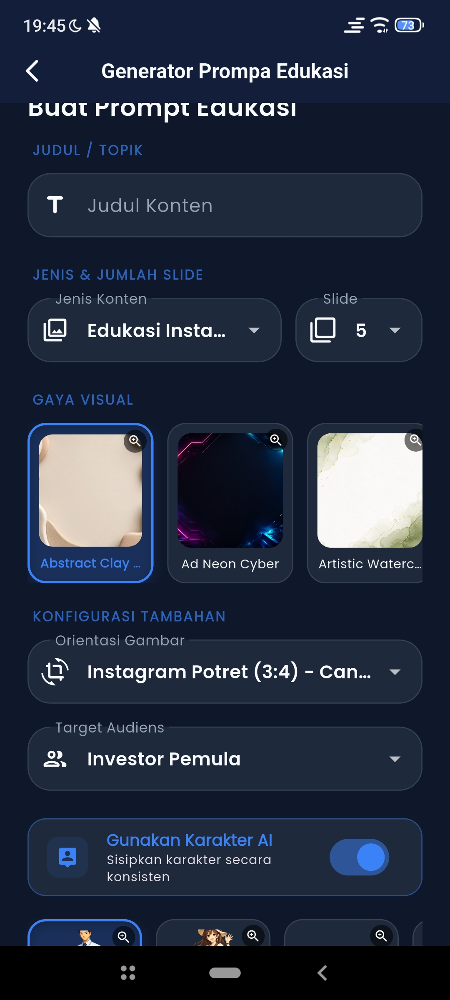
  
  *Deskripsi:* UI pengisian parameter pembuatan prompt konten edukasi (jumlah slide, orientasi gambar, pemilihan karakter AI, dan gaya desain).

* **Katalog Template Prompa**
  
  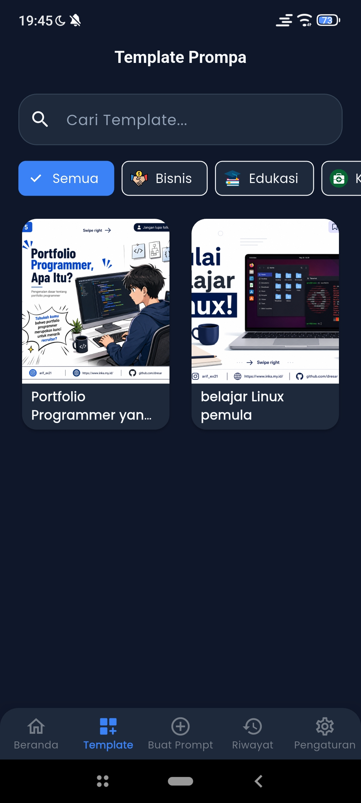
  
  *Deskripsi:* Galeri template siap pakai dengan bilah pencarian interaktif dan pemilah berbasis kategori.

* **Log Riwayat Pembuatan Prompt Pribadi**
  
  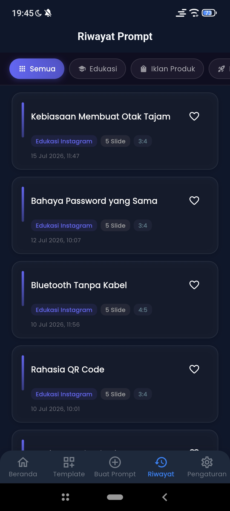
  
  *Deskripsi:* Daftar prompt yang pernah dibuat oleh akun pengguna aktif, lengkap dengan tombol favorit (simbol hati) untuk akses cepat.

* **Layar Pengaturan - Tab Umum**
  
  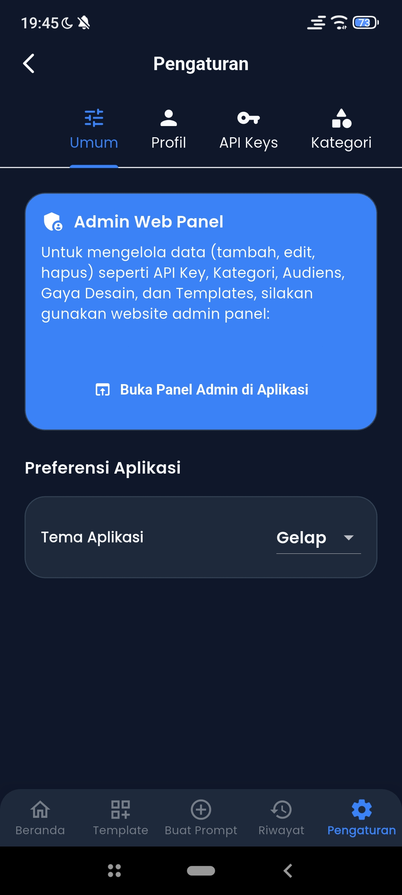
  
  *Deskripsi:* Bagian pengaturan preferensi tema aplikasi (Gelap/Terang) dan tombol cepat akses panel admin web bagi pengguna berhak akses administrator.

* **Layar Pengaturan - Tab Manajemen API Keys**
  
  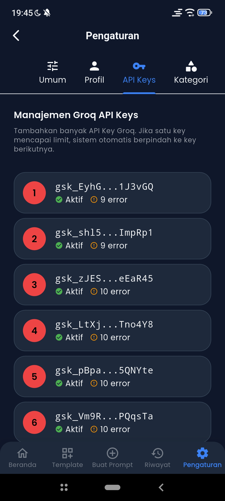
  
  *Deskripsi:* Manajemen rotasi API Key Groq langsung dari aplikasi seluler dengan pelacakan status kegagalan kunci secara real-time.

* **Layar Pengaturan - Tab Sunting Profil**
  
  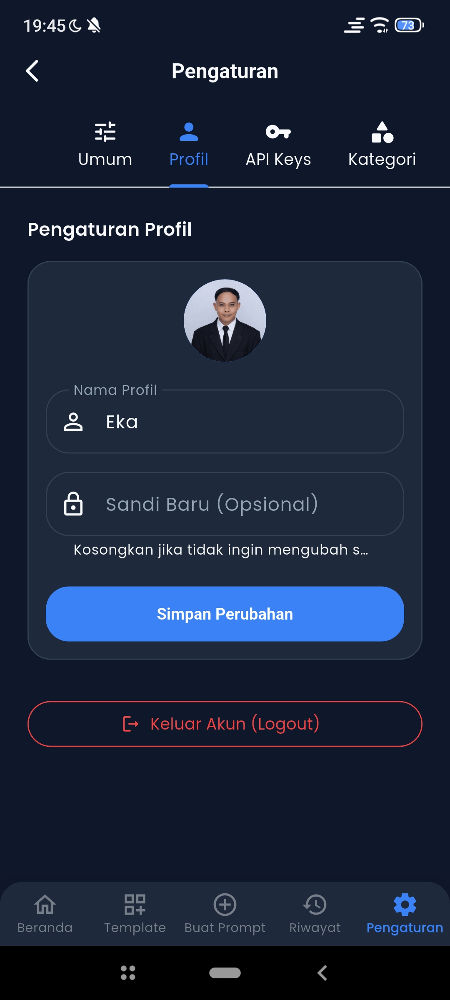
  
  *Deskripsi:* Antarmuka pengeditan nama pengguna, kata sandi, avatar profil, serta tombol keluar akun (logout).

* **Layar Pengaturan - Tab Target Audiens**
  
  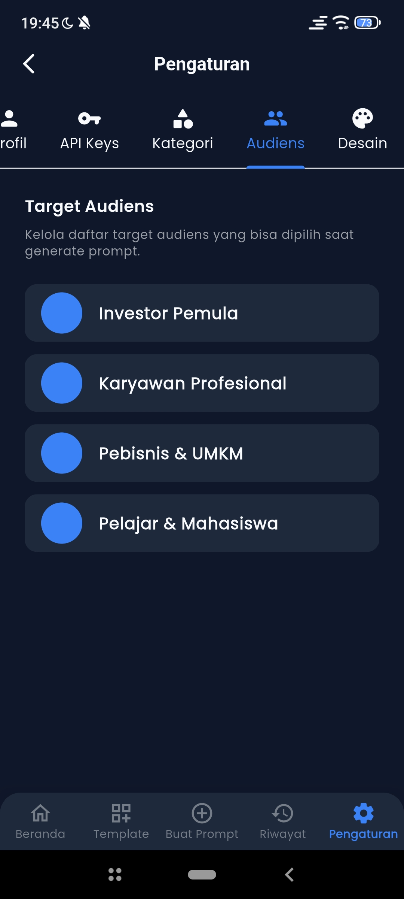
  
  *Deskripsi:* Modul pengaturan daftar audiens yang akan ditampilkan pada dropdown menu formulir generator.

---

## 🛠️ Alur Distribusi Berkas Utama Workspace

Berikut adalah peta penempatan file penting dalam workspace proyek ini:

```
promting_app/
├── .gitattributes                # Konfigurasi normalisasi teks Git & penanda file biner
├── .gitignore                    # Konfigurasi pengecualian file sampah build/secrets
├── README.md                     # Portal dokumentasi utama (File ini)
├── FRONTEND_DOCS.md              # Dokumentasi arsitektur frontend Flutter
├── BACKEND_API_DOCS.md           # Dokumentasi arsitektur backend Node.js
├── PANDUAN_INSTALASI.md          # Panduan instalasi server & aplikasi mobile
├── PANDUAN_PENGGUNAAN.md         # Panduan penggunaan fitur generator AI
├── seed_templates.sql            # Skema inisiasi database MySQL awal untuk template
├── assets/
│   └── demo/                     # File asset gambar demo aplikasi yang telah disingkat
├── backednya/                    # Folder root kode sumber Express API Gateway
│   ├── tsconfig.json             # Konfigurasi Compiler TypeScript
│   ├── db_migrate.js             # Skema sinkronisasi / migrasi data lokal ke cloud
│   └── src/
│       ├── index.ts              # Entry-point API Server & inisiasi database
│       └── controllers/          # Kontrol logika API & integrasi Groq AI
└── lib/                          # Folder root kode sumber Flutter Mobile
    ├── main.dart                 # Entry-point jalannya aplikasi seluler
    ├── core/                     # Modul core (Database sqlite, helper, tema)
    ├── providers/                # Modul provider untuk manajemen status UI
    └── screens/                  # Seluruh folder screen antarmuka pengguna
```
